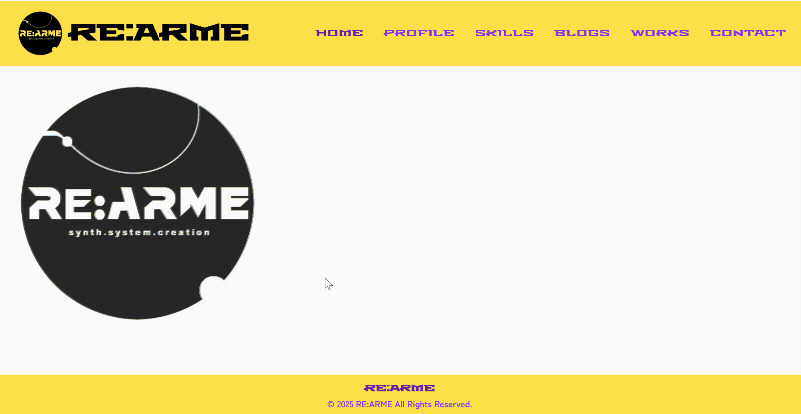

# REARME Portfolio


## 🎯 このサイトについて

RE:ARME（再武装）をコンセプトに作成した個人ポートフォリオサイトです。
「常に進化し続けるエンジニア」という姿勢を表現するため、生成AI（Claude）と協働しながら開発しました。
エレクトロニック/グリッチエフェクトを取り入れたデザインが特徴です。

**🔗 サイトはこちら:** https://rearme.vercel.app/

**🔗 デモ画像:**



## 🛠️ 使っている技術

- **フロントエンド:** React 18, TypeScript
- **スタイリング:** Tailwind CSS, DaisyUI
- **アニメーション:** Framer Motion
- **CMS:** microCMS（ブログ機能）
- **デプロイ:** Vercel
- **デザインツール:** GIMP, InkScape

## ✨ 実装した機能

- ロゴのグリッチエフェクトアニメーション（マウスホバーでレコードのように回転します）
- スマホ・タブレット対応のレスポンシブデザイン
- microCMSと連携したブログ機能（最新記事を自動表示）
- モーダルウィンドウ付きのプロジェクト紹介ページ
- カスタムデザインのテーブル表示

## 🎨 デザインのこだわり

**REARMEの由来**  
スペイン語で「再び武装する」を意味する言葉です。常に自分を再構築し、新たな挑戦を追い求めるという想いを込めて名付けました。

**ビジュアルの背景**  
90年代US/UKのクラブカルチャーとエレクトロニックミュージックから影響を受けています。
黄色と紫のコントラスト、グリッチエフェクトなど、テクノ/エレクトロの世界観を表現しました。

## 📦 ローカルで動かす方法
```bash
# パッケージのインストール
npm install

# 開発サーバーの起動
npm run dev

# 本番用ビルド
npm run build
```

## 📝 必要な環境変数

microCMSを使う場合は、`.env`ファイルに以下を設定してください：
```env
VITE_SERVICE_DOMAIN=your_microcms_service_domain
VITE_MICROCMS_API_KEY=your_microcms_api_key
```

## 🚀 開発のポイント

- 生成AI（Claude）を積極的に活用し、効率的に開発を進めました
- Vercelの自動デプロイ機能で、GitHubへのプッシュと同時にサイトが更新されます
- ロゴデザインはInkScapeとGIMPで自作しました

## 📄 ライセンス

MIT License

## 👤 作った人

**Sohey-K**  
インフラエンジニア

- GitHub: [@Sohey-k](https://github.com/Sohey-k)
- X: [@reep_of_face](https://x.com/reep_of_face)
